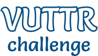

<h1 align="center">



</h1>

<h3 align="center">
  Bossabox Challenge developed by Italo Izaac 🤘
</h3>

<div align="center">


</div>

## Visão geral


Esta aplicação foi contruída utilizando **React** e técnicas como **TDD** e **BDD**. A mesma é proposta como desafio ([veja o desafio aqui](https://www.notion.so/Front-end-c12adcdbe7a1425dbfbcd5a397b4ff10)) da [Bossabox](https://bossabox.com) para participar do "processo seletivo" e conseguir se candidatar para vagas de trabalho remoto disponíveis no site.

<br /><br /><br />

## Indíce

- [Instalando](#instalando)
- [BUGs 🐛](#bugs-)
- [Versão Online 🌎](#versão-online-)
- [Licença](#licença)

## Instanlando

### 1. Clone do projeto:

```bash
$ git clone https://github.com/italoiz/bossabox-frontend-challenge.git
```

### 2. Instale as dependências:

> Se você utiliza NPM, substitua o comando `yarn` por `npm install`.

```bash
$ cd bossabox-frontend-challenge
$ yarn
```

### 3. Execute o projeto:

Rode o comando abaixo para rodar o projeto no seu browser:

> Se você utiliza NPM, substitua o comando `yarn dev` por `npm run dev`

```bash
$ yarn start
```

Este script irá executar também a API modelo fornecida pela Bossabox. Veja a API
[aqui](https://gitlab.com/bossabox/challenge-fake-api/tree/master).

## Versão Online 🌎

Há uma versão desta aplicação hospedada e rodando, porém a API na qual utiliza-se
tem limitações. Nenhuma ferramenta inserida através do formulário de "Nova Ferramenta""
é persistida na "base de dados", estamos utilizando um recurso open source da [Typeicode](https://github.com/typicode)
de servir um JSON como API Rest. Conheça [aqui](https://my-json-server.typicode.com/) o recurso.

Você pode ver a aplicação através da seguinte URL: `http://vuttr-challenge.com/`

## BUGs 🐛

Este é um projeto realizado para participar do desafio da Bossabox como explicado na [Visão Geral](#visao-geral) do projeto. Porém se você detectar algum 🐛 e gostaria de deixar uma sugestão de melhoria ou até mesmo algum _Pull Request_, ficarei muito feliz em aprender com sua contribuição!

## Licença

MIT © [Italo Izaac](https://italoiz.github.io)
